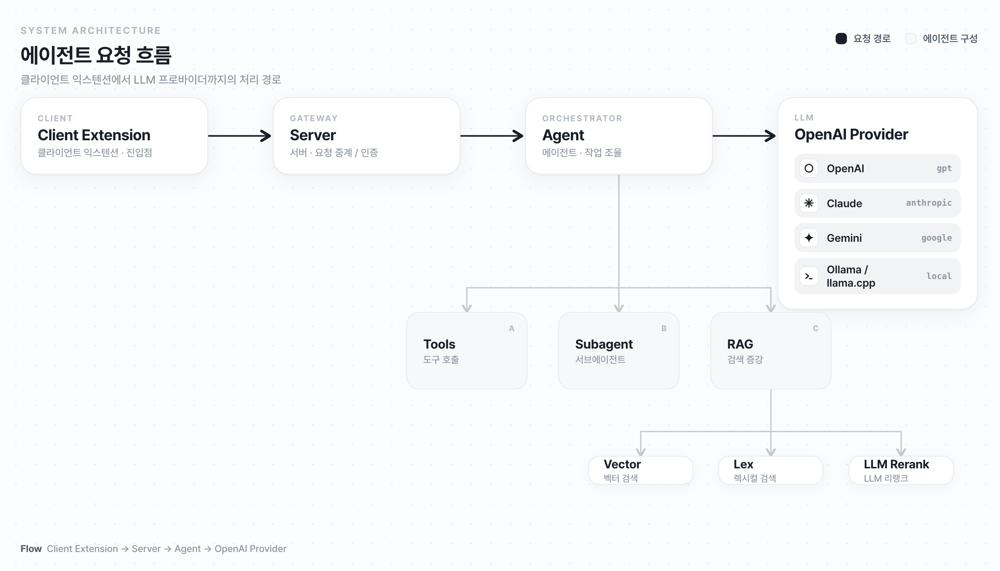
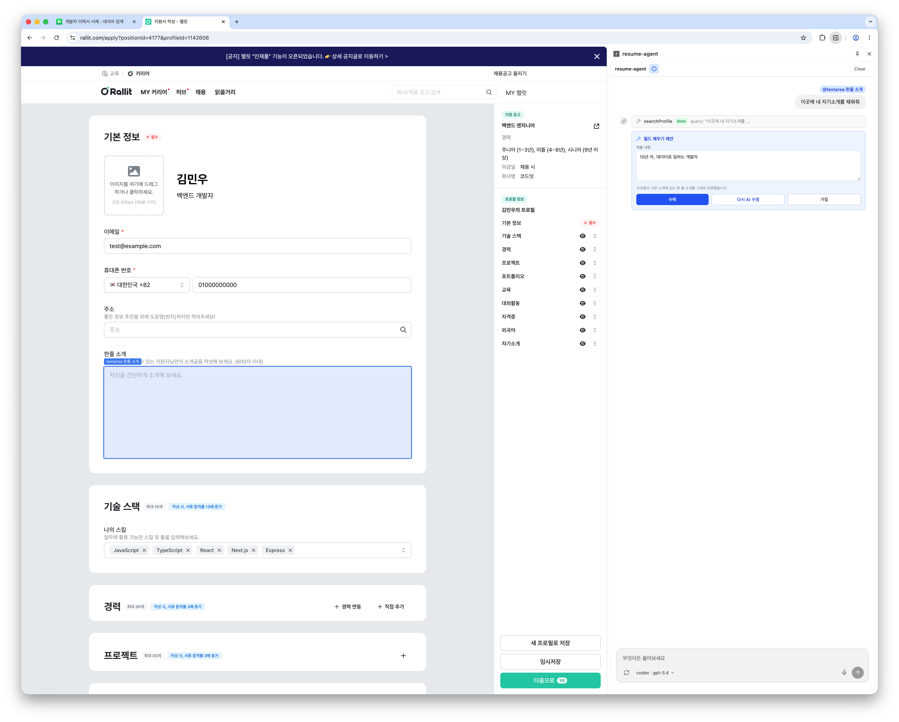
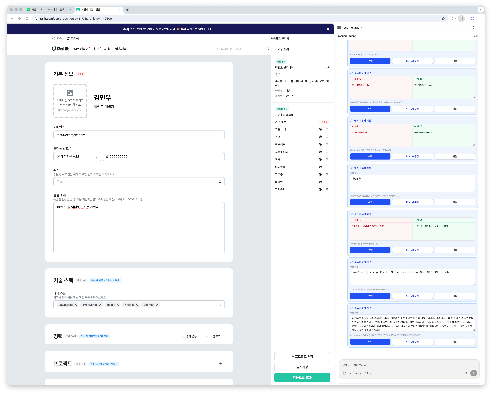

## 1. 과제 내용

이 과제는 개인 페르소나 데이터베이스를 활용해, 사용자가 어떤 웹 인터페이스에서도 이력서와 지원서 작성을 이어갈 수 있도록 돕는 개인화 이력서 에이전트 시스템을 제작하는 데 목적이 있다.

핵심은 브라우저에서 동작하는 에이전트 익스텐션으로 사용자의 개인 지식 그래프와 외부 웹 인터페이스를 연결하는 것이다. 사용자는 채용 사이트, 포트폴리오 입력 폼, Google Docs 같은 문서 작성 도구, 로컬 웹페이지 등 다양한 환경에서 자신의 이력과 경험을 불러와, 현재 작성 중인 맥락에 맞는 문장을 만든다.

이 시스템은 사용자가 평소에 작성한 이력, 프로젝트 경험, 기술 스택, 자기소개, 커리어 목표 등을 개인 페르소나 데이터베이스로 축적한다. 사용자는 에이전트와 대화하며 자신의 경험을 자유롭게 정리하고, 마크다운 문서나 이력서 파일 형태로 정보를 저장·가공한다. 개인의 경력 정보는 한 장의 고정된 이력서가 아니라 계속 업데이트되는 지식 데이터베이스로 관리된다.

사용자가 채용 사이트나 문서 작성 화면에서 이력서를 작성할 때, 에이전트는 브라우저 DOM에서 입력 필드의 의미를 파악한다. 그런 다음 개인 페르소나 데이터베이스에서 관련 경험을 검색해, 작성 중인 맥락에 맞는 표현을 제안한다. 반복 입력, 문장 다듬기, 직무별 표현 변경, 자기소개서 초안 작성은 에이전트가 보조하고, 사용자는 어떤 경험을 강조할지, 지원 직무와 자신의 강점을 어떻게 연결할지, 어떤 메시지를 전달할지에 집중한다.

이 시스템은 이력서 작성 과정을 단순한 문서 입력 작업에서, 사용자가 자신의 경험을 탐색하고 전략적으로 표현하는 과정으로 바꾼다. 사용자는 반복 작업을 줄이고, 지원 직무와 자신의 경험을 어떻게 연결할지처럼 효과적인 이력서를 만들기 위한 사고와 판단에 더 많은 시간을 쓴다.

## 2. 작품의 기술성

본 작품은 브라우저 익스텐션, 에이전트 서버, 도구 호출 구조, LLM provider, 개인 페르소나 검색 데이터베이스를 분리한 확장형 아키텍처로 구성된다.

[브라우저 DOM 기반 입력 컨텍스트 수집]

브라우저 익스텐션은 사용자가 현재 보고 있는 웹페이지의 입력 필드를 감지하고, 각 필드가 어떤 의미를 가지는지 파악하기 위해 DOM 기반 컨텍스트를 수집한다. 예를 들어 `label`, `aria-label`, `placeholder`, section heading, fieldset legend, CSS path 등의 정보를 분석해 해당 입력란이 이름, 경력 요약, 기술 스택, 자기소개, 프로젝트 설명 중 어떤 항목인지 추론한다.

사용자는 특정 입력 필드를 직접 선택해 세밀하게 조작한다. 에이전트는 선택된 DOM 요소의 의미를 해석한 뒤 개인 페르소나 데이터베이스에서 관련 근거를 검색한다. 그래서 단순히 빈칸을 채우는 데 그치지 않고, 현재 작성 맥락에 맞는 경험과 표현을 찾아 입력값으로 제안한다.

[CDP 기반 브라우저 조작]

이 시스템은 단순한 필드 자동완성을 넘어, 브라우저의 CDP 포트와 연결된 브라우저 조작 도구를 갖추고 있다. 에이전트는 이 도구로 실제 브라우저를 직접 조작한다. 페이지 열기, 클릭, 입력, 스크롤, 텍스트 조회, 스크린샷 확인 같은 작업을 수행하며 현재 브라우저 상태를 읽고 다음 행동을 결정한다.

사용자는 직접 선택한 DOM 요소를 중심으로 이력서 내용을 정밀하게 작성하거나, 에이전트가 브라우저 화면을 탐색하며 필요한 인터페이스를 조작하도록 맡긴다. 이 구조는 특정 채용 사이트의 고정된 폼 자동화가 아니라, 다양한 웹 환경에서 동작하는 범용 이력서 작성 에이전트를 뒷받침한다.

[사용자 승인 중심 입력 제안]

제안된 입력값은 DOM에 즉시 강제 적용되지 않는다. 사이드패널 채팅 UI에서 사용자가 수락하거나 거절하는 방식으로 설계했다. 에이전트는 입력값과 함께 제안 이유를 제공하고, 사용자는 해당 문장이 자신의 의도와 맞는지 확인한 뒤 적용 여부를 결정한다.

이 방식은 자동화의 생산성과 사용자 통제권 사이의 균형을 맞춘다. 이력서 작성은 개인의 경험과 표현 전략이 중요한 작업이기 때문에, 최종 판단은 사용자가 유지하고 반복 입력, 문장 초안 생성, 표현 다듬기 같은 작업은 에이전트의 도움을 받는다.

[3중 마크다운 인덱싱·랭킹 데이터베이스]

개인 페르소나 데이터베이스는 3중 마크다운 인덱싱·랭킹 구조를 기반으로 설계했다. 사용자가 챗봇 대화나 마크다운 문서로 이력, 프로젝트, 기술 스택, 자기소개, 커리어 목표를 자유롭게 기록하면, 시스템은 이를 검색 가능한 개인 지식 데이터베이스로 변환한다.

검색 과정은 세 단계로 이루어진다. 먼저 마크다운 문서의 제목과 섹션 구조를 기준으로 의미 단위를 분리한다. 다음으로 벡터 검색과 전문 검색을 함께 사용해 후보 문서를 찾고, 마지막으로 리랭킹 과정을 거쳐 현재 작성 맥락에 가장 적합한 근거만 선별한다. 설계 기준으로는 500~1,000 토큰 내외의 문서 단위를 검색 후보로 만들고, 상위 10~20개 후보를 리랭킹한 뒤 최종 2~5개 근거만 프롬프트에 주입하는 방식을 목표로 했다.

이 구조는 개인 기록 전체를 매번 모델에 넣는 방식보다 토큰 사용량을 약 70~90% 줄이면서도, 지원 직무나 입력 필드에 맞는 경험을 안정적으로 찾아낸다는 장점이 있다. 사용자는 자신의 경력 정보를 계속 축적하고, 에이전트는 그중 현재 작성 상황에 가장 적합한 정보만 선별해 활용한다.

[채팅 기반 익스텐션과 확장 가능한 Tools 구조]

본 시스템은 채팅 기반 브라우저 익스텐션과 확장 가능한 tools 구조를 적용했다. 사용자는 별도의 이력서 작성 앱으로 이동하지 않아도, 현재 보고 있는 채용 사이트나 문서 작성 화면 위에서 사이드패널 채팅 UI로 에이전트와 대화한다.

에이전트는 단순히 답변만 생성하는 챗봇이 아니다. 프로필 검색, 프로필 저장, 브라우저 조작, 필드 입력 제안, 서브에이전트 실행 같은 도구를 상황에 맞게 호출하는 실행형 에이전트로 설계했다. 이 구조 덕분에 특정 채용 사이트나 특정 문서 도구에 종속되지 않고, Google Docs, Notion, 채용 플랫폼, 포트폴리오 CMS 등 다양한 인터페이스로 확장된다.

새로운 기능이 필요할 때도 에이전트 전체를 다시 설계할 필요가 없다. 채용공고 URL 분석, 이력서 PDF 변환, 포트폴리오 링크 검증, 맞춤법 검사, 회사별 자기소개서 템플릿 생성 같은 기능은 독립적인 도구로 추가해 연결한다.

[서브에이전트 병렬 처리 구조]

서브에이전트 구조는 복잡한 이력서 작성 작업을 더 정교하게 처리하기 위한 핵심 기술 요소다. 일반적인 챗봇은 채용공고 이해, 사용자 경험 검색, 답변 전략 수립, 문장 생성을 하나의 모델이 한 번에 수행한다. 하지만 작업이 길어질수록 중요한 요구사항을 놓치거나, 근거가 약한 문장을 생성할 가능성이 있다.

이 문제를 줄이기 위해 작업을 역할별 서브에이전트로 나누었다. 채용공고 분석 에이전트는 요구 기술과 평가 기준을 추출하고, 프로필 매칭 에이전트는 개인 데이터베이스에서 관련 프로젝트와 성과를 찾으며, 답변 전략 에이전트는 문장 구조와 강조점을 정리한다.

이러한 병렬 처리 구조는 응답 시간을 줄이면서도 결과의 품질을 높인다. 각 서브에이전트가 독립적으로 분석한 결과를 메인 에이전트가 종합하기 때문에, 단순히 보기 좋은 문장이 아니라 채용공고의 요구와 사용자의 실제 경험을 연결하는 근거 중심의 답변을 생성한다.

[OpenAI 호환 Provider 구조]

마지막으로 OpenAI 호환 provider 구조를 적용해 로컬 LLM과 프론티어 LLM을 함께 쓰도록 했다. 에이전트는 특정 모델이나 특정 API에 고정되지 않고, OpenAI 호환 인터페이스를 따르는 provider로 로컬 모델, OpenRouter 기반 모델, 프론티어 모델 등을 상황에 따라 선택한다.

이 구조의 장점은 보안, 비용, 품질을 유연하게 조절한다는 점이다. 이력서와 경력 정보에는 민감한 개인 데이터가 포함될 수 있으므로, 사용자는 필요에 따라 로컬 모델을 사용해 외부 서버로 데이터를 보내지 않는 방식으로 작업한다. 반대로 복잡한 추론, 고품질 문장 생성, 직무 적합성 분석처럼 높은 성능이 필요한 작업에서는 프론티어 모델을 사용한다.

작업 성격에 따라 모델도 분리한다. 단순한 필드 자동완성이나 프로필 검색 요약은 저비용 모델 또는 로컬 모델로 처리하고, 자기소개서 최종 문장 생성이나 전략적 이력서 구성은 고성능 모델로 처리한다. 이렇게 전체 토큰 비용을 줄이면서도 중요한 작업에서는 높은 품질을 유지한다.

## 3. 제작 과정

제작 과정은 이력서 작성 과정에서 반복적으로 발생하는 문제를 분석하는 것에서 시작했다. 사용자는 여러 채용 사이트와 문서 도구를 오가며 같은 경력 정보를 반복 입력하고, 지원 직무마다 표현을 다시 조정해야 한다. 이를 해결하기 위해 독립적인 이력서 작성 웹앱이 아니라, 사용자가 실제로 작성 중인 브라우저 환경 위에서 동작하는 익스텐션을 핵심 인터페이스로 선택했다.

다음 단계에서는 서버, 웹 UI, TUI, 브라우저 익스텐션을 분리한 모노레포 구조를 구성했다. 서버는 API와 스트리밍 채팅, 에이전트 도구 호출을 담당하고, 익스텐션은 현재 페이지의 DOM 컨텍스트 수집과 사이드패널 채팅 UI를 담당하도록 나누었다. 공통 타입과 스키마는 별도 패키지로 분리해 프론트엔드와 백엔드가 같은 데이터 구조를 사용하도록 했다.

이후 개인 페르소나 데이터베이스를 구현했다. 사용자의 이력서, 프로젝트 경험, 기술 스택, 자기소개 문서를 마크다운 기반으로 저장하고, 이를 3중 마크다운 인덱싱·랭킹 구조로 검색되도록 만들었다. 문서를 추가하거나 수정하면 재인덱싱을 거쳐 최신 개인 정보가 에이전트 응답에 반영된다.

마지막으로 에이전트 도구 호출과 서브에이전트 구조를 구현했다. 브라우저 조작, 프로필 검색, 프로필 저장, 필드 입력 제안, 병렬 분석 기능을 각각 도구로 분리했고, 복잡한 작업은 여러 서브에이전트가 동시에 분석한 뒤 메인 에이전트가 종합하도록 구성했다.

이렇게 단순한 이력서 챗봇이 아니라, 사용자의 개인 지식과 실제 웹 인터페이스를 연결하고, DOM 기반 세밀한 입력과 CDP 기반 브라우저 조작까지 수행하는 실용적인 개인화 이력서 에이전트 시스템을 완성했다.

> 테스트 자료로는 Wonny님의 [오픈 이력서](https://wonny.oopy.io/)를 사용했다.

---
# 시연

[browser-use 영상](ref/browser-use.mp4)